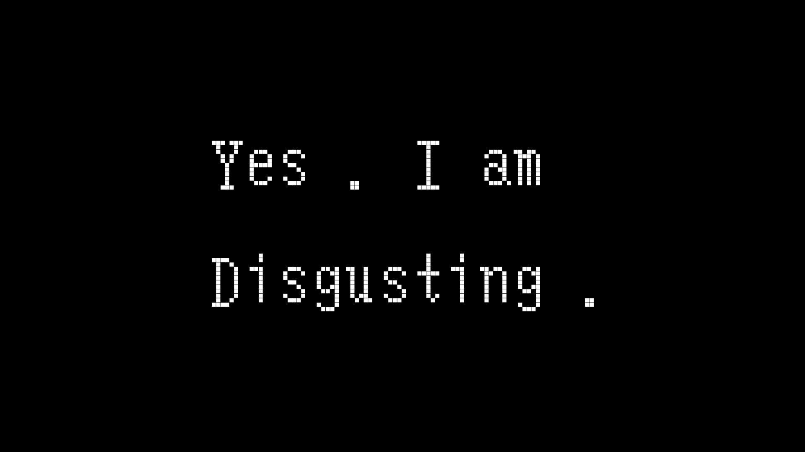

# 本文不考虑其他情况 一切以个人需求出发
```
设备：  Chromebook Thinkpad 13
版本号：63.0.3239.7 dev
```
如果本篇文章能够帮助到你们，麻烦请点个start

## 激活 初始化
因为寝室路由器的能直接接入万维网，那么激活 chromebook 只要连上 wifi 就可以，登陆好个人的 google 账号，google 会自动同步你所有的记录，当然如果你嫌 chromebook 安装的应用会影响到 pc 或 mac 端的使用，那么只要在设置同步里自行调整即可。

## 进入开发者模式
同时按下 esc + 刷新键(tp13 在第四个键) + 电源键即可，都是在最上面那一排。

然后 Chromebook 重启，然后按 Ctrl+D 继续，回车重启，上面的进度条走完了之后自动重启，就进入开发者模式了。

## 在 Chromebook 上使用 google play
不同设备支持 google play 的时间是不同的，有需求的同学可以参考[Chrome OS Systems Supporting Android Apps](https://www.chromium.org/chromium-os/chrome-os-systems-supporting-android-apps)

在上面表里，tp13 是不支持 google play 的，但是没关系，你可以通过把 Chromebook 改成开发者版本，就可以使用 google play，虽说 play 里支持的 Android app 很少，但是你可以通过安装 apk 来安装常用的 app。比如 $$r 虚荣等等。


更新完系统之后，打开设置看有没有亲爱的 google play 没有的话，再等等把。。。。


ps 强烈建议下虚荣玩玩，支持触摸屏，也支持键盘操作。

## 利用 crouton 安装 ubuntu
[git 链接](https://github.com/dnschneid/crouton)可以直接看文档。

[crouton](https://github.com/dnschneid/crouton/raw/master/installer/crouton)这是crouton的下载链接，下载完放在 Downloads 下。

用 Ctrl+ALT+T 调出 crosh 窗口，输入 shell。

查看 crouton 支持的 ubuntu 版本：
```
sh ~/Downloads/crouton -r list
```
下载 unity 14.04 ubuntu
```
sudo sh -e ~/Downloads/crouton -r trusty -t core,audio,xorg,x11,gtk-extra,unity,keyboard,cli-extra
```
接着等待，在网络好的情况下半小时差不多了，最后要求输入用户名和密码。

crouton 的文档里也有例子
```
sudo sh ~/Downloads/crouton -t xfce
sudo enter-chroot startxfce4 
```
但是我个人更喜欢 unity 的桌面一点(⊙﹏⊙)

进入 unity桌面
```
sudo startunity

在 chrome os 和 Ubuntu 之间切换：

从 C 到 U：shift + ctrl + alt + 前进键
从 U 到 C：shift + ctrl + alt + 后退键
```

## ubuntu 开发配置
其实一台低配的 Chromebook 装完 ubuntu 是有点吃力的，但是就是想折腾折腾。

打开终端输入，比较简单的下载了所以的先（之后没有需求的再删把。。）
```
sudo apt-get install ubuntu-desktop
```
```
sudo apt-get remove libreoffice-common -y          //删除libreoffice
sudo apt-get remove unity-webapps-common -y        //删除amazon
sudo apt-get remove thunderbird totem rhythmbox empathy brasero simple-scan gnome-mahjongg aisleriot gnome-mines cheese transmission-common gnome-orca webbrowser-app gnome-sudoku  landscape-client-ui-install onboard deja-dup -y
```
```
备注：

thunderbird：Mozilla 浏览器的邮件功能部件所改造的邮件工具

totem：影片播放器

rhythmbox：音乐播放和管理软件

empathy：即时通讯工具

brasero：光盘烧录软件

simple-scan：扫描工具

gnome-mahjongg：麻将游戏 -- 对对碰

aisleriot：纸牌游戏

gnome-mines：扫雷游戏

cheese：摄像头拍照和录像软件cheese

transmission-common：BT 客户端

gnome-orca：屏幕阅读器

webbrowser-app：系统自带 web 浏览器

gnome-sudoku：数独游戏

landscape-client-ui-install：远程管理软件

onboard：虚拟键盘

deja-dup：备份工具
```
设置中文环境
```
sudo apt-get install language-pack-zh-hans language-pack-zh-hans-base language-pack-gnome-zh-hans language-pack-gnome-zh-hans-base
sudo apt-get install `check-language-support -l zh`
sudo localectl set-locale LANG=zh_CN.UTF-8
```

主题配置 （个人癖好）还有一直用的一个壁纸
```
wget -q -O - http://archive.getdeb.net/getdeb-archive.key | sudo apt-key add -

sudo sh -c 'echo "deb http://archive.getdeb.net/ubuntu xenial-getdeb apps" >> /etc/apt/sources.list.d/getdeb.list'

sudo add-apt-repository ppa:noobslab/themes
sudo add-apt-repository ppa:noobslab/icons
sudo apt-get update
sudo apt-get install ubuntu-tweak -y
sudo apt-get install flatabulous-theme -y
sudo apt-get install ultra-flat-icons -y
sudo apt-get install vpnc git -y
```

之后安装的东西因人而异把，我会用 chrome vscode。。。。

## 删除 ubuntu
```
sudo delete-chroot chrootname
```
*chrootname: 所安装 ubuntu 的版本代号

## 小生不才，一家之言，将就将就。
问：点个start可否